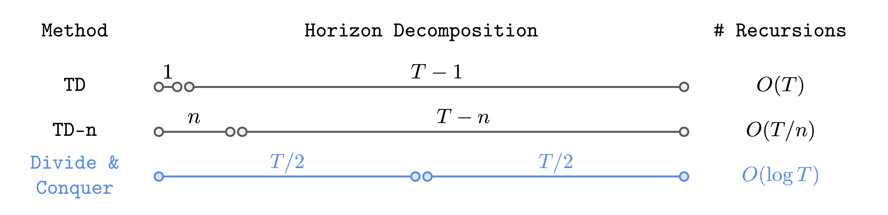

<div align="center">

<div id="user-content-toc" style="margin-bottom: 50px">
  <ul align="center" style="list-style: none;">
    <summary>
      <h1>Transitive RL</h1>
      <h2>:    Value Learning via Divide and Conquer</h3>
      <br>
      <h2><a href="https://arxiv.org/abs/2510.22512">Paper</a> &emsp;</h2>
    </summary>
  </ul>
</div>

</div>




## Installation

TRL requires Python 3.9+ and is based on JAX. The main dependencies are
`jax >= 0.4.26`, `ogbench == 1.1.0`, and `gymnasium == 0.29.1`.
To install the full dependencies, simply run:
```bash
pip install -r requirements.txt
```


## Usage

The main implementation of TRL is in [agents/trl.py](agents/trl.py),
and our implementations of baselines (GCIQL, GCFBC, QRL, CRL)
can also be found in the same directory.

Tuned hyperparameters for each environment and agent are provided in the paper.
Complete list of TRL commands here: [hyperparameters.sh](hyperparameters.sh)

```bash

# TRL

python main.py \
    --env_name=scene-play-oraclerep-v0 \
    --agent=agents/trl.py \
    --agent.lam=1.0 \
    --agent.expectile=0.7 \
    --agent.oracle_distill=True \
    --agent.pe_type=rpg \
    --agent.rpg.alpha=1 \
    --agent.actor_hidden_dims="(512, 512, 512)" \
    --agent.value_hidden_dims="(512, 512, 512)" \
    --agent.dataset.actor_geom_sample=False \
    --agent.dataset.actor_p_trajgoal=1.0 \
    --agent.dataset.actor_p_randomgoal=0.0 \
    --agent.dataset.value_geom_sample=True


# GCIQL

python main.py \
    --env_name=scene-play-oraclerep-v0 \
    --agent=agents/gciql.py \
    --agent.alpha=1.0 \
    --agent.actor_hidden_dims="(512, 512, 512)" \
    --agent.value_hidden_dims="(512, 512, 512)" \
    --agent.dataset.actor_geom_sample=False \
    --agent.dataset.actor_p_trajgoal=1.0 \
    --agent.dataset.actor_p_randomgoal=0.0 \
    --agent.dataset.value_geom_sample=True

# CRL

python main.py \
    --env_name=scene-play-oraclerep-v0 \
    --agent=agents/crl.py \
    --agent.alpha=3.0 \
    --agent.actor_hidden_dims="(512, 512, 512)" \
    --agent.value_hidden_dims="(512, 512, 512)" \
    --agent.dataset.actor_geom_sample=False \
    --agent.dataset.actor_p_trajgoal=1.0 \
    --agent.dataset.actor_p_randomgoal=0.0 \
    --agent.dataset.value_geom_sample=True

# GCFBC

python main.py \
    --env_name=scene-play-oraclerep-v0 \
    --agent=agents/gcfbc.py \
    --agent.actor_hidden_dims="(512, 512, 512)"

```


## Using large datasets (from [Horizon Reduction Makes RL Scalable](https://github.com/seohongpark/horizon-reduction/tree/master))

The paper uses 1B-sized datasets for the OGBench environments.
Since the original datasets are too large to be hosted, we provide 100M-sized datasets (1/10 of the original size),
which we found to be sufficient for most of the tasks.
These datasets can be downloaded with the following commands (see [this section of the OGBench repository](https://github.com/seohongpark/ogbench?tab=readme-ov-file#additional-features) for more diverse 100M-sized datasets available):
```bash
# cube-octuple-play-100m (100 datasets * 1000 length-1000 trajectories).
wget -r -np -nH --cut-dirs=2 -A "*.npz" https://rail.eecs.berkeley.edu/datasets/ogbench/cube-octuple-play-100m-v0/
# puzzle-4x5-play-100m (100 datasets * 1000 length-1000 trajectories).
wget -r -np -nH --cut-dirs=2 -A "*.npz" https://rail.eecs.berkeley.edu/datasets/ogbench/puzzle-4x5-play-100m-v0/
# puzzle-4x6-play-100m (100 datasets * 1000 length-1000 trajectories).
wget -r -np -nH --cut-dirs=2 -A "*.npz" https://rail.eecs.berkeley.edu/datasets/ogbench/puzzle-4x6-play-100m-v0/
# humanoidmaze-giant-navigate-100m (25 datasets * 1000 length-4000 trajectories).
wget -r -np -nH --cut-dirs=2 -A "*.npz" https://rail.eecs.berkeley.edu/datasets/ogbench/humanoidmaze-giant-navigate-100m-v0/
```

To use the full 1B-sized datasets, you need to generate them manually.
Generating a 1B-sized dataset requires 1000-1500 CPU hours and 279-551GB of disk space.
To generate datasets, run the commands below.

> [!NOTE]
> To generate datasets for `humanoidmaze-giant`, you first need to download the expert policy and add the `ogbench/impls` directory to `PYTHONPATH` (as stated below).
 
<details>
<summary><b>Click to expand the full list of commands</b></summary>

```bash
# You may parallelize the commands below. Each command takes 1-1.5 hours to finish.

git clone git@github.com:seohongpark/ogbench.git
cd ogbench

# cube-octuple-play-1b (1000 datasets * 1000 length-1000 trajectories).
for i in $(seq -w 0 999); do
    python data_gen_scripts/generate_manipspace.py --seed=$i --env_name=cube-octuple-v0 --save_path=<YOUR_DATA_DIRECTORY>/cube-octuple-play-1b-v0/cube-octuple-play-v0-$i.npz --num_episodes=1000 --max_episode_steps=1001 --dataset_type=play;
done

# puzzle-4x5-play-1b (1000 datasets * 1000 length-1000 trajectories).
for i in $(seq -w 0 999); do
    python data_gen_scripts/generate_manipspace.py --seed=$i --env_name=puzzle-4x5-v0 --save_path=<YOUR_DATA_DIRECTORY>/puzzle-4x5-play-1b-v0/puzzle-4x5-play-v0-$i.npz --num_episodes=1000 --max_episode_steps=1001 --dataset_type=play;
done

# puzzle-4x6-play-1b (1000 datasets * 1000 length-1000 trajectories).
for i in $(seq -w 0 999); do
    python data_gen_scripts/generate_manipspace.py --seed=$i --env_name=puzzle-4x6-v0 --save_path=<YOUR_DATA_DIRECTORY>/puzzle-4x6-play-1b-v0/puzzle-4x6-play-v0-$i.npz --num_episodes=1000 --max_episode_steps=1001 --dataset_type=play;
done

# humanoidmaze-giant-navigate-1b (250 datasets * 1000 length-4000 trajectories).
# (1) Download the expert policies from the OGBench repository.
wget https://rail.eecs.berkeley.edu/datasets/ogbench/experts.tar.gz
tar xf experts.tar.gz && rm experts.tar.gz
# (2) Add the `impls` directory to PYTHONPATH.
export PYTHONPATH="impls:${PYTHONPATH}"  
# (3) Generate datasets.
for i in $(seq -w 0 249); do
    python data_gen_scripts/generate_locomaze.py --seed=$i --env_name=humanoidmaze-giant-v0 --save_path=<YOUR_DATA_DIRECTORY>/humanoidmaze-giant-navigate-1b-v0/humanoidmaze-giant-navigate-v0-$i.npz --num_episodes=1000 --max_episode_steps=4001 --dataset_type=navigate --restore_path=<YOUR_EXPERT_DIRECTORY>/humanoid --restore_epoch=40000000;
done
```

</details>


## Acknowledgments

This codebase is built on top of reference implementations from [Horizon Reduction Makes RL Scalable](https://github.com/seohongpark/horizon-reduction/tree/master).
